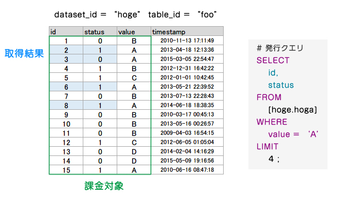

#Google BigQuery


## BigQueryとは

Googleが提供するSQLライクな構文で問い合わせができる、ビッグデータ解析サービス。  
インフラ構築、保守、などのもろもろの面倒事が不要で、低価格で運用ができる。  
__かつ、高速！__

TB級の大規模なDBのフルテーブルスキャンも数秒でこなす  
・・・5000台のマシンを使って並列処理している（ものすごい力技）  


## SQLとの違い

- データのネスト  
- データのupdateができない  
- javascriptでUDFが使える  

## おいくら？

### 課金形態

- 使用ストレージ容量  

$0.02 / 1GB (1月)  

- クエリでスキャンするデータ量  

$5 / 1TB  
(毎月1TB分は無料)  

- StreamingInsert  

100,000行につき$0.01  
(バルクインサートは無料)  

### 課金対象

BQはフルスキャン  
= WHEREで対象の行を絞っても課金対象は変わらない  
→テーブルの行数　×　使用したカラム　= スキャンするデータ量  



なので基本的にテーブルを月単位・日付単位などで分割して保存しておく  

## 使ってみようBQ

https://console.developers.google.com/project

### 基本形

```sql
# データセット名を付け加える以外は基本的にSQLと同じ
SELECT
    カラム名
FROM
    [データセット名.テーブル名]
WHERE
    条件
;
```

### UNION

BQにはUNIONという演算子はない。  
テーブル名をカンマ区切りで指定するだけでUNION ALLとして機能する

```sql
SELECT
    remote_host
FROM
    [Rejob.access_log_20150513],[Rejob.access_log_20150516]
LIMIT 100
;
```

### TABLE_DATE_RANGE

前述の通り、日付単位などで分割されているため、期間が長くなると指定するのが大変

```sql
# access_log_で始まるテーブル名で日付の期間指定
# テーブル名は'YYYYMMDD'で付けておく
SELECT
    remote_host, request_time
FROM (
    TABLE_DATE_RANGE(
        Rejob.access_log_,
        TIMESTAMP('2015-05-01'),
        TIMESTAMP('2015-05-10')
    )
)
;
```

## JOIN

JOIN ・・・ 結合先のテーブルサイズが8MB以下でないとならない

大規模テーブルでは "JOIN __EACH__" を使用する

```sql
SELECT
    c.id,
    sd.name
FROM
    [Rejob.company] c
        INNER JOIN
    [Rejob.shop_data] sd
        ON
    c.id = sd.com_id
LIMIT
    10;
# エラーが出る


SELECT
    c.id,
    sd.name
FROM
    [Rejob.company] c
        INNER JOIN EACH
    [Rejob.shop_data] sd
        ON
    c.id = sd.com_id
LIMIT
    10;
# EACHをつけると大きいテーブルでもJOINできる
```

### 正規表現系

通常のDBでは遅くなりがちな正規表現もBQならガンガン叩ける

- REGEXP_MATCH - 正規表現にマッチするものを返す

```sql
REGEXP_MATCH(title, r'[Rr]uby( on [Rr]ails)?')
```

- REGEXP_EXTRACT - 正規表現でマッチした箇所(\1)を返す

```sql
REGEXP_EXTRACT(title, r'Ruby on (.*)$')
```

- REGEXP_REPLACE - 正規表現で置換

```sql
REGEXP_REPLACE(title, r'(Ruby|Java[Ss]cript|Perl)', 'Python')
```

### WITHIN、FLATTEN

ネストされたフィールドに対して使う  
*今回用意したデータセットでは使わないので割愛

### その他

その他にもいろいろな機能や関数があるので、詳しくはGoogleのリファレンスを参照  
https://cloud.google.com/bigquery/query-reference

## 叩いてみようBQ

サンプルで用意されている無料のデータセットがあるので、いろいろと試してみましょう  

[publicdata:samples]
- github_nested
- github_timeline
- gsod
- natality
- shakespeare
- trigrams
- wikipedia

### ちなみに

#### データのインサート

- Fluentdでのストリーミングインサート  
- Embulkでのバルクインサート  
の事例が多いです

#### GAとの連携

Google Analyticsのプレミアム契約となったので、  
BigQueryへ生ログのエクスポートができるようになります