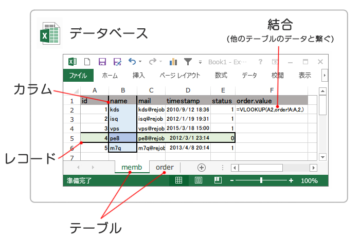

# はじめに

## SQLを学ぶことの意義

データを抽出することが目的ではない

- データの抽出  

- (データのクレンジング・前処理)  

- 分析  

- 施策立案・実施  

- 施策の評価・結果の考察  


#### データはPDCAを回すうえでの土台となる
・・・データが間違っているとすべてが上手くいかない

→間違えないための知識

#### 抽出以降の分析、施策立案、結果の考察、全てにおいて論理的な思考が必要となる

→論理的な思考をするためのトレーニング

#SQLおさらい

BigQueryの前に・・・

## データベースの構造

#### データベース

テーブルの集合  

#### テーブル

レコードの集合  

#### レコード

一つ一つのデータ  
テーブルの各行  

#### カラム（フィールド）

データを構成する情報  
テーブル、レコードの各列  

#### ・・・Excelで言うと

データベース = ファイル自体  
テーブル = シート  
レコード = 行(1～)  
カラム = 列(A～)  



## 主な命令文

- UPDATE - データの更新  
- INSERT - データの作成（挿入)  
- DELETE - データの削除  
→覚えなくてよし！(マーケでは)
<br><br>
- SELECT  
データの取得  
→__覚えよう！！！__

## 実際のSQL文を簡単に復習

- 基本

```mysql
SELECT # 表示するカラムを指定する
    id, in_day, shop_id
FROM # 使用するテーブル指定する
    scout_log
WHERE # 抽出する条件
    in_day BETWEEEN '2015-01-01' AND '2015-05-01'
;
```

- 結合

```mysql
SELECT
    sl.id, sl.in_day, m.id, m.name, m.city
FROM
    scout_log AS sl
        INNER JOIN
    members AS m
        ON sl.usr_id = m.id
WHER
    sl.in_day BETWEEEN '2015-04-01' AND '2015-05-01'
;
```

- 集計

```mysql
SELECT
    m.city, count(sl.id)
FROM
    scout_log AS sl
        INNER JOIN members AS m
            ON sl.usr_id = m.id
WHERE
    sl.in_day BETWEEEN '2015-04-01' AND '2015-05-01'
GROUP BY
    m.city
;
```

## 実際に叩いてみよう

#### 現行リジョブDBについて
各テーブルでstatusというカラムが使われている  
　status = 1 ・・・使用されているデータ  
　status = 0 ・・・削除されたデータ  

→不要なレコードをテーブル上から物理的に削除するのではなく、  
__statusというフラグで論理的に削除__して（存在しないように見せかけて）いる。  
ので、原則WHERE句にstatus = 1を指定する  

※membersなど一部のテーブルではstatusの意味合いが変わる  
(members.status = 0 ・・・会員情報の削除ではなく、退会済という意味)  

※__リニューアルで大幅に刷新される予定__  

#### よく使う関数・式・演算子など

||説明|
|-------------|-------------|
|BETWEEEN|範囲を指定|
|LIKE|あいまい検索|
|IN|集合知のうちいずれかに該当する|
|COUNT|値を数える|
|SUM|値の合計|
|DISTINCT|重複除外|
|NOW|現在の時刻|
|DATE_FORMAT|日付フォーマットの変更|
|FIND_IN_SET|カンマ区切りデータのいずれかに該当する|
|INTERVAL|日付の計算|
|CASE|条件別に値を変更する|
|EXISTS|≒ IN|
|UNION (ALL)|和集合|
|LEFT(RIGHT) JOIN|結合|
|INNER JOIN|結合|
|GROUP BY|集約|
|HAVING|集約結果への条件|
|GROUP_CONCAT|集約したデータを1つにする|

## 暗黙の型変換

```mysql
# status は整数型
status = 1   # 整数で指定
status = '1' # 文字列として指定
status = 1.0 # 浮動小数点として指定
```

上記は全て正しく評価される。  
自動的に必要な型(≠適切な型)へ変換して評価してくれるため

しかし・・・
パフォーマンスが落ちたり、意図しない結果になることがあるので、
カラムのデータ構造を理解し、極力正しい型で指定する

```mysql
'rejob' < 'jigen'
# エラーが出そう・・・でも通ります。つまり
# 元のカラムにどういうデータが入ってるかわかっていないと結果が予測できない
```

しかし効果的に使えば便利！
例えば  

```mysql
WHERE timestamp BETWEEEN '2015-01-01' AND '2015-02-01'

timestampはDATETIME型なので
'2015-01-01' => '2015-01-01 00:00:00'
'2015-02-01' => '2015-02-01 00:00:00'
へ自動的に変換される
```

つまり下記を表す簡略的な書き方になる

```mysql
'2015-01-01 00:00:00' ≦ timestamp ≦ '2015-01-31 23:59:59'
# 厳密には 「<= '2015-02-01 00:00:00'」なので
# '2015-02-01 00:00:00' ジャストのデータがあれば含まれてしまうが
# ほとんど存在しないので、簡略的に書いている
```

下記は全て等価

```mysql
timestamp BETWEEEN '2015-01-01' AND '2015-02-01'

timestamp >= '2015-01-01'
    AND timestamp <= '2015-02-01'

timestamp >= '2015-01-01 00:00:00'
    AND timestamp <= '2015-02-01 00:00:00'
```

## NULLのおはなし

NULLの場合は is NULL


#### よくある落とし穴

各サロンの応募数を抽出したい！

```msyql
SELECT
    sd.cus_id, sd.name, count(sl.id)
FROM
    shop_data AS sd LEFT JOIN scout_log AS sl
        ON sd.cus_id = sl.shop_id
WHERE
    sl.status = 1
    AND sd.status = 1
GROUP BY
    sd.cus_id
;
# 案件データと応募データを結合し、応募IDの数をカウントする

→　__× bad __

#### なぜ？

LEFT JOIN・・・ 右側のテーブルに存在しないデータは__NULLが返る__

|sd.cus_id|sd.name|sl.id|
|------|------|------|
|1|エステサロンA|<b style="color:red;">NULL</b>|
|2|美容室B|121034|
|2|美容室B|124054|
|3|ネイルサロンC|125612|

サロンB,Cは応募データが存在するので応募ID(sl.id)が返される  
サロンAは応募が0件=データが存在しないのでNULLが返る  

上記をサロンごとにGROUP BYで集約し、COUNTで集計すると  

|sd.cus_id|sd.name|__count(sl.id)__|
|------|------|------|
|<b style="color:red;">1</b>|<b style="color:red;">エステサロンA</b>|<b style="color:red;">0</b>|
|2|美容室B|2|
|3|ネイルサロンC|1|

こうなるはず  
(COUNTはNULL以外の値の数を数える = NULLだけの場合は0)  

だけど実際は  

|sd.cus_id|sd.name|__count(sl.id)__|
|------|------|------|
|2|美容室B|2|
|3|ネイルサロンC|1|

どこに原因があるんでしょう？  

```mysql
WHERE
    sl.status = 1
 ```

__ココ！！！！__

### NULLとは

状態が不明、存在しない、定義されていない

箱があった時、下記は明確に区別される  
__・箱の中身が空であることがわかっている__  
__・箱の中身がわからない = 何か入っているかもしれないし、入っていないかもしれない__  

下記はいずれも不明(unknown)が返される

```mysql
1 > NULL
10 < NULL
14 = NULL
200 <> NULL
NULL = NULL
```

中身のわからない箱Aと、中身のわからない箱Bは、中身が同じであるか？  
__→わからない__

NULLであることを判定するには、SQLではISを使用

```mysql
# boxがNullである時
box = NULL  # unknown
box is NULL # True
```


#### 正解例

```mysql
# 不正解
WHERE
    sl.status = 1
    AND sd.status = 1
GROUP BY
    sd.cus_id
    
# status が1 → 含む
# status が0 → 含まない
# status がNULL → 含まない
```

```mysql
# 正解
WHERE
    (sl.status = 1 OR sl.status IS NULL)
    AND sd.status = 1
GROUP BY
    sd.cus_id
```

## まとめ

・暗黙の型変換  
元の型によって、同じクエリでも結果がことなる場合がある  

・NULL  
他の値と同じようには扱えない  

#### つまり
元のデータの素性を知らないと適切な表現ができない
- どのように定義されているか
- どんなデータの集まりか
- __分析するにはさらに、データの分布、バラつき、特性・・・etc__

## 分析するために

今回教えたのはSQLで比較的陥りやすい細かい仕様  

例えば  
「between '2015-01-01' and '2015-02-01'は2/1のデータは含まれない」  
という表面上のことだけを覚えてしまうと、  
DATE型で「between '2015-01-01' and '2015-02-01'」という指定をしてしまう  

間違ったデータ = データの信ぴょう性自体がなくなる  
　→分析結果を間違える  
　　→施策が失敗する  

なぜそうなっているかを知ることで、正しい行動を選択できる

## 分析で大事なこと

- 要件定義 (マーケ・エンジニアだけでなく重要)

- 問題の切り分ける・分解する

- 抜けなく、漏れなく

- データの性質を知る・考える

## 例題

### 2015年3月の各都道府県ごとの採用率を抽出する

#### (1) 要件定義
- 使用するデータは2015/03/01～2015/03/31の応募データ
- 採用率 = 採用数 / 応募数
- 各都道府県ごとに分ける

#### (2) 問題の切り分け・分解
- 2015年3月のデータに限定する  
- 応募数を出す  
- 採用数を出す  
- 各都道府県ごとに分ける  

#### (3) 抜けなく、漏れ無く  
- 削除済のデータは含まれていないか  
status = 1を指定  
- 採用数は「採用」のフラグだけでいいか  
要件に以下を追加する  
採用数 = 採用、採用(店）、採用(求)  
- 3月に採用数・応募数が正確に取れなくなるようなバグは起きていないか  
関係各部署にヒアリングを行う  
→バグは特に無し  

#### (4) データの性質を知る・考える
採用数は常に変動する  
3月に応募しても採用が決定するのは1ヶ月後など  
→ 2ヶ月でほぼ決まるので大きな問題はない

### クエリの組み立て方

最終的なデータの完成形を考える・・・(1)  
そのためにどういったデータが必要か考える・・・(2)  
そのためにどういったデータが必要か考える・・・(3)  
そのためにどういったデータが必要か考える・・・(4)  
(4)に必要なクエリを考える・・・(5)  
(5)を(3)の形にするためのクエリ・条件を考える・・・(6)  
(6)を(2)の形にするためのクエリ・条件を考える・・・(7)  
(8)を(1)の形にするためのクエリ・条件を考える・・・(8)  

```mysql
SELECT

FROM

WHERE

;
```

→__完成!!__  

## 課題

- 全求職者の数（退会除く）

- 東京都の女性で、エステ希望の求職者数

- 都道府県ごとの求職者数

- 都道府県ごとの平均求職者数 

- 都道府県ごとの求職者数を、男女で分けて算出

- 退会者が最も多い都道府県

- 案件ごとの応募数

- 会社ごとの応募数

- 会社の平均応募数

- 会社ごとの現在掲載している案件

- 2014年以降の各月応募数、採用数、採用率

- 2015年以降に登録したユーザーのうち、登録から1日以内に応募したユーザー（重複して表示させない）

- 応募者の平均年齢

## 最後に

興味があれば,  
- インデックス  
- 実装依存な書き方  
なんかも

## SQLを覚えるには？

__とにかく叩け！！！！__